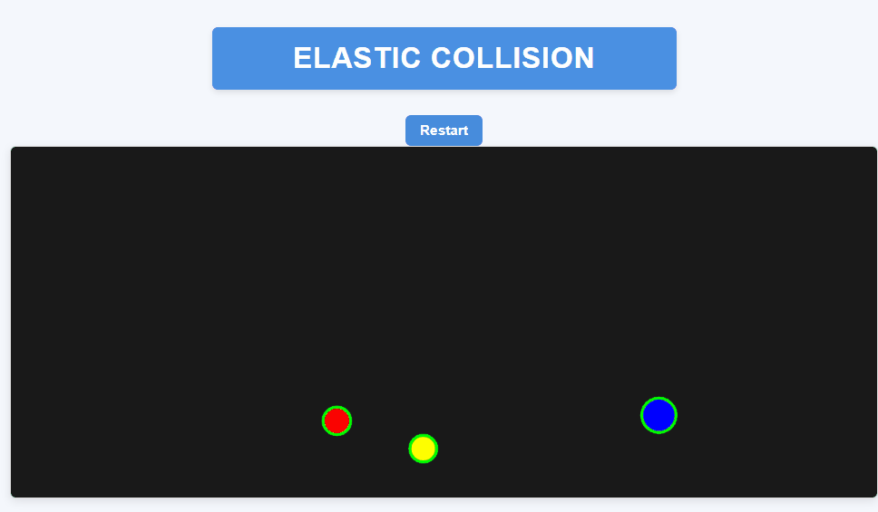

# Colisão Elástica em Simulação de Física

## Visão Geral

Este projeto implementa um sistema de colisão elástica entre múltiplas bolas. Em uma colisão elástica, tanto o momento linear quanto a energia cinética são conservados.

## Como Funciona a Colisão Elástica

Quando duas bolas colidem, o sistema:

1. Detecta a sobreposição e ajusta as posições para evitar penetração
2. Calcula a velocidade relativa ao longo da linha normal de colisão
3. Aplica impulsos baseados na conservação de momento, respeitando as diferentes massas
4. Utiliza um coeficiente de restituição de 1.0 para colisões perfeitamente elásticas
5. Implementa um impulso mínimo para prevenir que bolas fiquem "grudadas"

<div align="center">
  
</div>

## Implementação

O código usa vetores para calcular com precisão os impulsos de colisão, resultando em um comportamento físico realista. As direções e velocidades das bolas após a colisão dependem de:

- Massas relativas das bolas
- Velocidades no momento do impacto
- Ângulo de colisão

As trajetórias resultantes simulam o comportamento esperado na física do mundo real.

## Força de Arrasto (Drag Force)

A simulação agora implementa uma força de arrasto que simula a resistência do ar. Esta força:

- É proporcional ao quadrado da velocidade (característica de arrasto em fluidos em velocidades maiores)
- Opera na direção oposta ao movimento
- Utiliza um coeficiente de arrasto de 0.0008, calibrado para proporcionar uma desaceleração sutil e realista
- Só é aplicada quando a velocidade está acima de um limite mínimo, evitando que objetos em movimento lento sejam afetados excessivamente

```javascript
drag() {
  const speedSq = this.velocity.magSq();
  // Only apply drag when velocity is significant
  if (speedSq < 0.01) return;

  let dragForce = this.velocity.copy();
  dragForce.normalize().mult(-1);
  const dragCoef = 0.0008;

  dragForce.setMag(dragCoef * speedSq);
  this.applyForce(dragForce);
}
```

Esta implementação proporciona um comportamento mais realista às bolas, que gradualmente perdem velocidade ao se moverem pelo espaço, similar ao que ocorreria em um ambiente real com resistência do ar.
